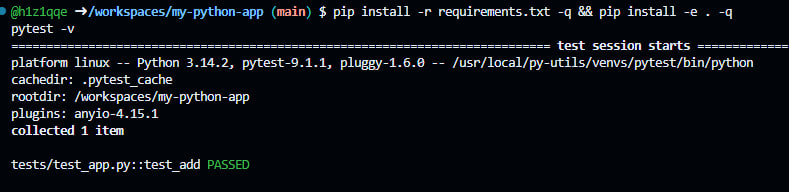
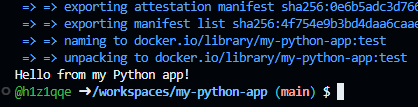
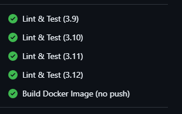
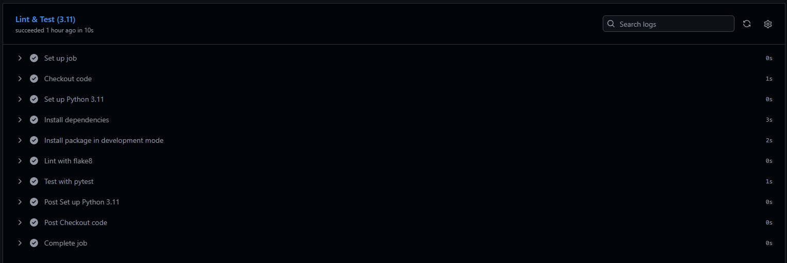

# 🐍 my-python-app

> Учебный проект: Python-приложение с CI-пайплайном в **GitHub Actions** —
> линтер **flake8**, тесты **pytest** на матрице из 4 версий Python и сборка **Docker-образа**.
> Вся разработка выполнена в **GitHub Codespaces** — без установки Python и Docker на локальную машину.

## ✨ Что проверяет CI

| Job | Что делает |
|---|---|
| **Lint & Test** ×4 (Python 3.9 / 3.10 / 3.11 / 3.12) | строгий прогон `flake8` → мягкий прогон `flake8` → тесты `pytest` |
| **Build Docker Image (no push)** | после успешных тестов собирает Docker-образ на раннере GitHub (только пуши в `main`) |

## 🗂 Структура проекта

~~~text
my-python-app/
├── .github/
│   └── workflows/
│       └── ci.yml        # GitHub Actions workflow
├── img/                  # скриншоты отчёта
├── myapp/
│   ├── __init__.py       # маркер пакета
│   └── app.py            # функция add() + точка входа
├── tests/
│   └── test_app.py       # тесты pytest
├── requirements.txt      # зависимости (pytest, flake8)
├── setup.py              # установка пакета в dev-режиме
├── Dockerfile
└── README.md
~~~

## 🛠 Ход работы (GitHub Codespaces)

### Шаг 1 — репозиторий и Codespace
Создан публичный репозиторий `my-python-app` с README, затем открыт Codespace:
**Code → Codespaces → Create codespace on main**. Python, pip, Docker и git уже предустановлены.

### Шаг 2 — структура проекта

~~~bash
mkdir -p .github/workflows myapp tests && \
touch .github/workflows/ci.yml myapp/__init__.py myapp/app.py tests/test_app.py setup.py requirements.txt Dockerfile README.md
~~~

### Шаг 3 — код приложения
`myapp/app.py` — функция `add(a, b)` и `main()` с приветствием.
`setup.py` с `find_packages()` — установка пакета в development-режиме,
чтобы импорт `myapp` работал из любой директории (важно для CI).

### Шаг 4 — тесты
`tests/test_app.py` — три проверки функции `add()`: `2+3=5`, `-1+1=0`, `0+0=0`.

### Шаг 5 — CI workflow
`.github/workflows/ci.yml`:
- **матрица из 4 версий Python** — код проверяется на 3.9, 3.10, 3.11 и 3.12 одновременно;
- два прогона `flake8`: строгий (только критичные ошибки) и мягкий (со сложностью и длиной строк);
- `pip install -e .` — пакет ставится в dev-режиме прямо в job'е;
- job `docker-build` зависит от тестов (`needs: test`) и запускается только при пуше в `main`.

### Шаг 6 — линтер и тесты локально

~~~bash
pip install -r requirements.txt -q && pip install -e . -q
flake8 . --count --select=E9,F63,F7,F82 --show-source --statistics
pytest -v
~~~

~~~text
tests/test_app.py::test_add PASSED                           [100%]

============================== 1 passed ===============================
~~~

flake8 завершился без замечаний (пустой вывод = код чист).

### Шаг 7 — сборка Docker-образа

~~~bash
docker build -t my-python-app:test .
docker run --rm my-python-app:test
~~~

~~~text
Hello from my Python app!
~~~

### Шаг 8 — пуш и результат в Actions

~~~bash
git add -A && git commit -m "Add Python app with CI" && git push
~~~

Все 4 job'а матрицы и сборка Docker-образа — зелёные ✅

## 🚀 Быстрый старт

~~~bash
git clone https://github.com/h1z1qqe/my-python-app.git
cd my-python-app
pip install -r requirements.txt && pip install -e .
pytest -v
python myapp/app.py

# или через Docker:
docker build -t my-python-app:test . && docker run --rm my-python-app:test
~~~

## ⚙️ Как устроен pipeline

~~~text
push / PR → Lint & Test ×4 (3.9 | 3.10 | 3.11 | 3.12): flake8 → pytest
                └── success + push в main → Build Docker Image (no push)
~~~

## 🧰 Технологии

`Python 3.9–3.12` · `GitHub Actions` · `flake8` · `pytest` · `Docker` · `GitHub Codespaces`

## ✅ Выводы

- Настроил матричное тестирование: один workflow проверяет код сразу на 4 версиях Python.
- Освоил двухуровневый линт: строгий прогон ловит критичные ошибки, мягкий — стиль кода.
- Разобрался, зачем нужен `setup.py` и установка в dev-режиме для корректных импортов в CI.
- Собрал Docker-образ на раннере GitHub без локального Docker.
- GitHub Codespaces закрывает всю инфраструктуру: редактор, терминал, Docker — в браузере.
MDEOF
